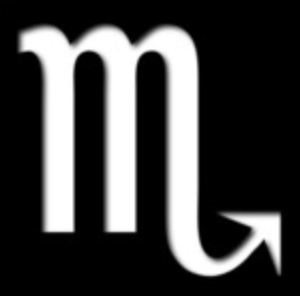

# Assignment 4
Skyla Jossell

Summer 2021 MMC 5277: Web Design Principles

This project is a continuation of Assignment 3 which is a website about the Scorpio zodiac.

## Resources
[Hover Effects] (https://ufl.zoom.us/recording/play/a_Pu_zI41WSHTwe17P00Er9QaIPfydeUhBJBxa665DAERx0L-e5Z-lfJ5uJu-U_M?autoplay=true&startTime=1540689323000)

[CSS Animations] (https://ufl.zoom.us/recording/play/pFAh_A8oQ2fLWqWoLa0SNUoqDk10-_X-vQMVbrUHvjw1BsLK16Wi4KQYberm4SnB?autoplay=true&startTime=1540684427000)

[CSS Animation Exercises] (https://www.w3schools.com/css/css3_animations.asp)

### Message
I, Skyla A. Jossell  , have read the point deduction list and understand that I will lose points for missing items.

#### Images
The images are pulled from google. Images look like this :
 

 
